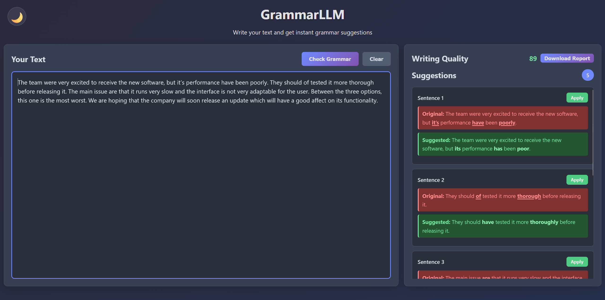

# WriteAI
WriteAI is an open-source framework for automated grammar correction, writing quality assessment, and structured feedback generation using fine-tuned large language models. It performs sentence-level error detection and correction, computes quantitative writing quality scores based on detected error spans, and generates detailed, downloadable [PDF reports](https://github.com/whiteh4cker-tr/grammar-llm/blob/main/static/pdf/example-writing-quality-report.pdf) with highlighted differences between original and corrected text. Designed for reproducible experimentation and evaluation, WriteAI provides a REST API and web interface for integration into research workflows and supports CPU-based execution without requiring GPU resources.

[](https://buymeacoffee.com/icecubetr)




## Features

### Core Features
- Real-time grammar and spelling correction
- AI-powered suggestions using fine-tuned LLMs
- Writing quality scoring (0–100) based on error-to-word ratio
- [PDF report](https://github.com/whiteh4cker-tr/grammar-llm/blob/main/static/pdf/example-writing-quality-report.pdf) generation with visually highlighted original and corrected sentences
- Individual suggestion acceptance
- Clean, responsive web interface
- FastAPI backend with llama.cpp integration
- Support for multiple grammar models
- Doesn't require a GPU
- REST API for programmatic access

### Multi-Tab Interface
WriteAI features a tabbed interface with three distinct writing tools:

1. **Grammar Check**
   - Check your text for grammar, spelling, and punctuation errors
   - Get instant suggestions to improve your writing
   - View writing quality score and download detailed reports

2. **Paraphrase**
   - Rephrase your text in multiple styles:
     - **Corrected**: Grammar-corrected version
     - **Formal**: Professional and structured tone
     - **Casual**: Conversational and relaxed tone
     - **Concise**: Condensed and efficient version
   - Compare different writing styles side-by-side

3. **AI Chat**
   - Chat with an AI assistant about writing, grammar, or any topic
   - Get writing advice and explanations
   - Persistent conversation history saved automatically

## Deployment

### Docker Deployment

#### Using Docker Compose (Recommended)
```bash
docker-compose up -d
```

### Electron Desktop App

#### Building the Desktop Application

The project includes an Electron app for desktop deployment. Build options are available for macOS, Windows, and Linux.

**Prerequisites:**
- Node.js and npm installed
- The FastAPI backend running (the Electron app connects to the local API)

**Build all platforms:**
```bash
cd electron-app
npm install
npm run build
```

**Platform-specific builds:**

**macOS (DMG):**
```bash
cd electron-app
npm run build:mac
```
The built app will be in `dist/WriteAI-1.0.0.dmg`

**Windows (NSIS Installer):**
```bash
cd electron-app
npm run build:win
```
The built app will be in `dist/WriteAI Setup 1.0.0.exe`

**Linux (AppImage):**
```bash
cd electron-app
npm run build:linux
```
The built app will be in `dist/WriteAI-1.0.0.AppImage`

**Run locally during development:**
```bash
cd electron-app
npm install
npm start
```

## Installation

1. Clone the repository:
```bash
git clone https://github.com/whiteh4cker-tr/grammar-llm.git
cd grammar-llm
```

2. Create a virtual environment (recommended):
```bash
python -m venv venv
source venv/bin/activate  # On Windows: venv\Scripts\activate
```

3. Install dependencies:
```bash
pip install -r requirements.txt
```
## Usage

1. Start the application:
```bash
uvicorn main:app --reload --host 0.0.0.0 --port 8000
```
2. Open your browser and navigate to:
```text
http://localhost:8000
```

## Example Usage

### Web Interface
Simply paste or type your text in the editor and click "Check Grammar". The application will:
1. Analyze your text and display suggestions with highlighted differences
2. Calculate and display a writing quality score (0–100) based on the ratio of errors to total words
3. Provide a "Download Report" button to generate a PDF report containing:
   - Writing quality score
   - All suggestions with original and corrected sentences
   - Visual highlighting of error words (red) and corrections (green)
   - WCAG 2.0 AA compliant color contrast for accessibility

### API Usage
The application exposes a REST API for programmatic access:

```bash
# Send text for correction
curl -X POST "http://localhost:8000/correct" \
  -H "Content-Type: application/json" \
  -d '{"text": "your text here"}'
```

### Using Python
```python
import requests, json

URL = "http://localhost:8000/correct"
payload = {"text": "She dont like the apples. this is a bad sentence"}

resp = requests.post(URL, json=payload, timeout=30)
resp.raise_for_status()
print(resp.status_code)
print(json.dumps(resp.json(), indent=2, ensure_ascii=False))
```

### 📦 Using Postman
- Method: POST
- URL: `http://localhost:8000/correct`
- Headers: `Content-Type: application/json`
- Body (raw → JSON): `"text": "She dont like the apples. this is a bad sentence" }`

#### Output (when corrections are suggested)
```json
{
    "suggestions": [
        {
            "original": "She dont like the apples. this is a bad sentence",
            "corrected": "She doesn't like the apples. This is a bad sentence",
            "sentence": "Sentence 1",
            "start_index": 0,
            "end_index": 48,
            "original_highlighted": "She <span class=\"error-word\">dont</span> like the apples. <span class=\"error-word\">this</span> is a bad sentence",
            "corrected_highlighted": "She <span class=\"corrected-word\">doesn</span><span class=\"corrected-word\">'</span><span class=\"corrected-word\">t</span> like the apples. <span class=\"corrected-word\">This</span> is a bad sentence"
        }
    ],
    "corrected_text": "She doesn't like the apples. This is a bad sentence"
}
```

#### Output (when input is already correct)
```json
{
    "suggestions": [],
    "corrected_text": "This is a good sentence. This is another good sentence."
}
```

## Configuration
The application uses the GRMR-V3-G4B-Q8_0 model by default. The model will be automatically downloaded on first run (approx. 4.13GB).

## Functionality Documentation

### Core Endpoints

**Grammar Correction Endpoint**
- **Endpoint**: POST `/correct`
- **Request Body**: `{"text": "your text here"}`
- **Response**: Returns a `CorrectionResponse` object containing:
  - `suggestions` (List[Suggestion]): a list of per-sentence suggestion objects. Each suggestion includes `original`, `corrected`, `sentence`, `start_index`, `end_index`, and HTML-highlighted fields (`original_highlighted`, `corrected_highlighted`). **Only sentences with a meaningful correction are included; `suggestions` may be empty.**
  - `corrected_text`: The fully corrected version of the input text (this field is always returned)

**Apply Suggestion Endpoint**
- **Endpoint**: POST `/apply-suggestion`
- **Use Case**: Apply a single suggestion to the original text
- **Request Parameters**: Original text, suggestion index, and suggestions list

**Apply Multiple Suggestions Endpoint**
- **Endpoint**: POST `/apply-suggestions`
- **Use Case**: Apply multiple suggestions to the original text at once
- **Features**: Handles overlapping suggestions intelligently by keeping the rightmost replacement
- **Note**: This endpoint is available for programmatic API clients. The web frontend applies suggestions one at a time using the `/apply-suggestion` endpoint instead.

**AI Chat Endpoint**
- **Endpoint**: POST `/chat`
- **Request Body**: `{"message": "your question", "history": []}`
- **Response**: Returns a `ChatResponse` object containing:
  - `response`: The AI assistant's reply
- **Features**: Maintains conversation history for contextual responses, powered by Qwen2.5 language model

**Text Restructuring/Paraphrasing Endpoint**
- **Endpoint**: POST `/restructure`
- **Request Body**: `{"text": "your text here"}`
- **Response**: Returns a `RestructureResponse` object containing:
  - `original`: Original input text
  - `corrected`: Grammar-corrected version
  - `formal`: Professional and structured tone
  - `casual`: Conversational and relaxed tone
  - `concise`: Condensed and efficient version
- **Features**: Provides four different writing style options in a single request

**Health Check Endpoint**
- **Endpoint**: GET `/health`
- **Response**: Returns status of the application and model status

### Model Details
- **Model**: GRMR-V3-G4B (Quantized to 8-bit)
- **Context Window**: 4096 tokens
- **Capabilities**: Grammar correction, spelling correction, punctuation fixes, and style improvements
- **GPU Required**: No - runs on CPU with llama.cpp

## Testing & Verification

### Manual Testing Steps

1. **Verify Application Start**
   ```bash
   uvicorn main:app --reload --host 0.0.0.0 --port 8000
   ```
   Expected console output:
   ```
   ============================================================
   WriteAI
   ============================================================
   Server starting on http://localhost:8000
   (Also accessible on http://127.0.0.1:8000)
   ============================================================
   ```

2. **Test Health Check**
   ```bash
   curl http://localhost:8000/health
   ```
   Expected response: `{"status":"healthy","model_loaded":true}`

### Docker Testing
```bash
docker-compose up
curl http://localhost:8000/health
```
Expected: Application is accessible and responsive

## Community Guidelines

### Contributing
We welcome contributions from the community! Here's how you can help:

1. **Fork the Repository**
   ```bash
   git clone https://github.com/whiteh4cker-tr/grammar-llm.git
   cd grammar-llm
   ```

2. **Create a Feature Branch**
   ```bash
   git checkout -b your-feature-name
   ```

3. **Make Your Changes**
   - Ensure your code follows the existing style
   - Test your changes thoroughly
   - Update documentation as needed

4. **Submit a Pull Request**
   - Push your changes to your fork
   - Open a pull request describing your changes
   - Link any related issues
   - Wait for review and feedback

### Reporting Issues
Found a bug or have a feature request? Please open an issue on GitHub:

1. **Check existing issues** to avoid duplicates
2. **Provide detailed information**:
   - Description of the problem
   - Steps to reproduce
   - Expected vs. actual behavior
   - System information (OS, Python version, etc.)
   - Console output or error messages

3. **Use clear titles and descriptions**

### Getting Support
- **GitHub Issues**: For bug reports and feature requests
- **Documentation**: Check the README and code comments for detailed information
- **Discussions**: Use GitHub Discussions for general questions and support

### Code of Conduct
Please be respectful and constructive in all interactions with other community members.
